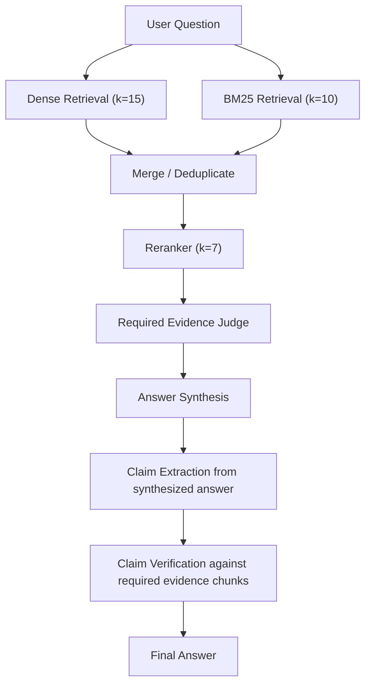

# Development Notes

## Key takeaways

- Stay deterministic when possible, give LLMs only the smallest possible responsibility
- Prompts and pipelines must be properly evaluated
  - run simulations and evaluations, use synthetic tests when real data is missing, but use different models and approaches to prevent bias with production
  - treat prompt versions like code versions for regression testing, config evaluation...
  - use results to set RAG parameters
- Prevent hallucinations in sythesis step with verification against evidence
- Dense retrieval can miss useful lexical matches, LLM judge can improve precision after keyword-based retriever introduces noise
- Structured outputs are valuable, but should still be verified (lists, missing items...)
- Instead of numerical `confidence` let LLM use labels with clear distinction (`REQUIRED`, `NOT_REQUIRED`) and give `reason` for easier debugging

## Timeplan

### February 25–26

- Overall research into Python, routing, chunking, embeddings, and RAG.
- **Start simple**: basic implementation of the bot without LLM complexity.
  - Basic keyword-based routing
    - `DOCS_ANSWER`: Answers a question from documentation
    - `TX_LIST`: Lists transactions in a given timeframe
    - `TX_SUMMARY`: Answers a question related to the sum of the expenses in a given timeframe
    - `EXPLAIN_TX_SUMMARY`: Lists transaction that made up `TX_SUMMARY`
    - `OUT_OF_SCOPE`
  - Create a bank transactions "database" and repository
  - Implement basic regex query parsing for transaction summaries
  - On `TX_EXPLAIN` route, automatically list transactions from the last summary stored in state
  - Set up basic logging

### March 12

- Basic document retrieval:
  - Document store
  - Chunking
  - Retrieval without RAG using Jaccard similarity

### March 23

- Start with LLM integration
  - `ROUTING`
    - Replace regex router with an LLM-based decision making
  - `TX_EXPLAIN`
    - Add an LLM timeframe parser
      - Retrieve raw timeframe information from the user message
      - Do not let the LLM resolve dates itself, let the application code handle date resolution
      - Let the LLM do as little work as necessary: the less work it has to do, the fewer opportunities it has to make mistakes
  - Add a `reason` field to LLM outputs for better debugging

### April 28–29

- `EXPLAIN_TX_SUMMARY`
  - Add LLM
  - Identify references relative to the current message, such as:
    - "last sum"
    - "the other sum"
- `DOCS_ANSWER`
  - **Research**: Investigate chunking strategies
  - Chunking:
    - Split documents into chunks by paragraphs
    - Prepend title "breadcrumbs" to each paragraph
  - Add chunk embeddings.
    - Performance: Persist embeddings to avoid recomputation and rebuild embeddings only when documents change
  - Retrieval
    - Retrieve top-k chunks
    - **Problem**: Top-k retrieval returns also irrelevant chunks
      - **Initial solution**: Introduce a primitive relevance filter based on relevance thresholds
  - Let the LLM synthesize the answer strictly from retrieved chunks - primitive

### June 23

- Mainly cleanup and refactoring
- Timeframe parser refactor

### July 14-15

- More refactoring, type fixes
- Unit testing for timeframes

### August 12-13

- **Problem:** Verifying LLM manually outputs is impractical.
  - **Solution:** Use structured outputs
- Additional refactoring

### August 18

- **Question:** Does an LLM-generated `CONFIDENCE` as float provide any real value?
  - **Decision:** Remove it, keep `reason` for now

### August 22-23

- **Question:** How to ensure synthesized answer does not have hallucinations?
  - Investigated options such as logprobs and RAGAS
  - Implemented an LLM answer verifier judge that checks claims against evidence using labels:
    - `SUPPORTED`
    - `NOT_SUPPORTED`
    - `CONTRADICTED`
- **Question:** How can prompt quality be evaluated?
  - Implemented a prompt evaluator:
    - Run a prompt against a set of labeled cases
    - Calculate success rate
    - Store evaluation results
  - Add prompt loaders: Support multiple prompt versions, use version defined in config

### August 25, 27, 28, 29

- Refactor the entire project - mainly single responsibility principle.
- Move from a heavily prototyped implementation toward a version with better readability, structure, and maintainability.

### August 30

- `DOCS_ANSWER` retrieval strategy needs to be improved
  - Add reranker
- Add local embedding model

### September 1-3

- refactors

### September 5-10

- **Question:** How to set up retrieval strategy for best performance?
  - Automatized document-retrieval evaluation pipeline is needed
    - Documents/chunking can change
    - Manually creating an evaluation dataset is difficult
    - Gold labels can become outdated when either changes
  - Dagster pipeline implementation was a fail
    - Create simple custom pipeline and persist each step
    - Use embeddings, LLM models, judges etc. that are different to the production to prevent bias in the evaluation results.
      - For Question generation use RAGAS, include multihop questions.
      - Use LLM Judge to filter "high quality" questions - Documentation can contain metadata which are present in some chunks, RAGAS creates questions from these chunks as well
        - **TODO?** Filter these chunks using LLM judge before RAGAS questions generation
      - Run two models for dense retrieval + BM25 to generate candidate chunks
      - Powerful LLM judge (for high quality labeling) labels candidate chunks as "REQUIRED", "RELEVANT", and "IRRELEVANT"

### September 11, 13

- **Problem:** After retriever and reranker steps, there are still chunks that should not be used for answer synthesis
  - Solution: Use LLM judge as additional "expensive" filter
  - Tried three-way relevance filtering, however cheaper models had issues with classifying the chunks correctly (distinction between `REQUIRED` and `RELEVANT`). Besides the user probably does not need exhaustive answer with distantly relevant information.
  - Use only `REQUIRED` and `NOT_REQUIRED`

### September 17-18

- **Problem**: Even LLM structured output can be invalid (e.g. missing values in a list)
  - Implement additional (optional) validation step for LLM outputs.
- **Problem**: Retrievers, reranker, judge... How to set parameters such as top_k for best performance?
  - Add configuration for each RAG evaluation step
    - **Target**: Run simulation with various top_k values and evaluate with `recall`, `complete recall` and `precision`.
  - Added BM25 to retrieval step
  - Pipeline: Dense retrieval+BM25 -> reranker -> judge -> synthesis -> verification

#### BM25 Retrieval Comparison

Compared setup with and without BM25.

- **RET** — embedding retriever
- **R+B** — union of embedding retrieval and BM25 retrieval
- **RRK** — reranker output
- **J** — chunks retained by the required-evidence judge
- **Δ** — percentage-point change after adding BM25

For configurations with `RET(k) >= 10`, `BM25(k)=10` is used in the comparison. For `RET(k)=5`, `BM25(k)=5` is used.

##### Required Recall

| RET(k) | BM25(k) | RRK(k) | Retrieval without BM25 | Retrieval with BM25 |  Δ Retrieval | Judge without BM25 | Judge with BM25 |      Δ Judge |
| -----: | ------: | -----: | ---------------------: | ------------------: | -----------: | -----------------: | --------------: | -----------: |
|      5 |       5 |      5 |                  81.9% |           **95.5%** | **+13.6 pp** |              79.6% |       **89.9%** | **+10.3 pp** |
|     10 |      10 |      5 |                  85.3% |           **97.5%** | **+12.2 pp** |              80.8% |       **90.0%** |  **+9.2 pp** |
|     10 |      10 |      7 |                  85.3% |           **97.5%** | **+12.2 pp** |              81.1% |       **91.8%** | **+10.7 pp** |
|     10 |      10 |     10 |                  85.3% |           **97.5%** | **+12.2 pp** |              82.1% |       **91.8%** |  **+9.7 pp** |
|     15 |      10 |      5 |                  87.8% |           **99.3%** | **+11.5 pp** |              83.2% |       **91.8%** |  **+8.6 pp** |
|     15 |      10 |      7 |                  87.8% |           **99.3%** | **+11.5 pp** |              83.5% |       **93.6%** | **+10.1 pp** |
|     15 |      10 |     10 |                  87.8% |           **99.3%** | **+11.5 pp** |              83.5% |       **93.6%** | **+10.1 pp** |
|     15 |      10 |     12 |                  87.8% |           **99.3%** | **+11.5 pp** |              84.5% |       **94.2%** |  **+9.7 pp** |

##### Complete Required Recall

This metric measures the percentage of questions for which **all required chunks** survived the pipeline stage.

| RET(k) | BM25(k) | RRK(k) | Judge without BM25 | Judge with BM25 |            Δ |
| -----: | ------: | -----: | -----------------: | --------------: | -----------: |
|      5 |       5 |      5 |              71.4% |       **82.1%** | **+10.7 pp** |
|     10 |      10 |      5 |              73.8% |       **83.3%** |  **+9.5 pp** |
|     10 |      10 |      7 |              73.8% |       **84.5%** | **+10.7 pp** |
|     10 |      10 |     10 |              73.8% |       **84.5%** | **+10.7 pp** |
|     15 |      10 |      5 |              77.4% |       **85.7%** |  **+8.3 pp** |
|     15 |      10 |      7 |              77.4% |       **86.9%** |  **+9.5 pp** |
|     15 |      10 |     10 |              77.4% |       **86.9%** |  **+9.5 pp** |
|     15 |      10 |     12 |              78.6% |       **88.1%** |  **+9.5 pp** |

##### Relevant Precision After Judge

Adding BM25 substantially improves recall without degrading the final precision of useful evidence.

| RET(k) | BM25(k) | RRK(k) | Without BM25 | With BM25 |       Δ |
| -----: | ------: | -----: | -----------: | --------: | ------: |
|      5 |       5 |      5 |        91.3% | **91.9%** | +0.6 pp |
|     10 |      10 |      5 |    **91.9%** |     91.4% | -0.5 pp |
|     10 |      10 |      7 |        90.1% | **91.2%** | +1.1 pp |
|     10 |      10 |     10 |    **89.7%** |     88.6% | -1.1 pp |
|     15 |      10 |      5 |        89.9% | **91.5%** | +1.6 pp |
|     15 |      10 |      7 |    **90.9%** |     90.8% | -0.1 pp |
|     15 |      10 |     10 |        87.4% | **88.8%** | +1.4 pp |
|     15 |      10 |     12 |        85.6% | **86.9%** | +1.3 pp |

### September 23-25, 28

- **Weakness:** RAG evaluation tests are synthetic, but "golden tests" are missing.
  - BM25 improvement score can be artificially inflated - BM25 is used in synthetic datasets generation as well
  - Add logs persistance with log level filtering.
    - **TODO:** Update the logs structure (or create a transformer) so "error" or "warning" logs from the production can be easily added to the evaluation datasets for further prompts and pipeline config refinements.
- refactors

## DOC_ANSWER pipeline schema

### Selected RAG Configuration

Evaluation results for current setup can be [found here](rag_eval/data/artifacts/summaries/summary_2026-09-28_21:24:15.txt).

The selected retrieval configuration is:

```text
Embedding Retriever top_k = 15
BM25 top_k                = 10
Reranker top_k            = 7
```

For `RET(15) + BM25(10) + RRK(7)`:

| Metric | RRK(5) | RRK(7) | Change |
|---|---:|---:|---:|
| Required recall after reranking | 92.4% | **94.2%** | **+1.8 pp** |
| Required recall after judge | 89.5% | **91.4%** | **+1.9 pp** |
| Complete required recall after reranking | 85.5% | **89.2%** | **+3.7 pp** |
| Complete required recall after judge | 79.5% | **83.1%** | **+3.6 pp** |
| Relevant precision after judge | **94.2%** | 91.5% | -2.7 pp |

Compared with larger reranker outputs, this configuration favors **precision and lower downstream LLM workload** over maximum required-chunk recall.



## Future work

### Tests

- Unit tests currently cover only timeframes
- Add regression tests for each LLM task (prompt)
  - currently only claim_verifier has basic setup
  - RAG retrieval has evaluation pipeline with synthetic datasets
- Add integration tests

### `DOCS_ANSWER`

- Regenerate synthesis with more powerful LLM when verification returns `NOT_SUPPORTED`?
- Expand testing datasets using production logs, create real benchmark dataset
- If documentation expands, consider vector store such as FAISS for better performance
- Experiment with multihop questions decomposition, separate retrieval, merge, then rerank and judge -> Would it improve `complete recall`?

### `TX_LIST`, `TX_SUMMARY`

- Ask for clarification when user provides an incomplete or ambiguous timeframe.
- Consider using LLM synthesizers in these routes.
- Explicit date range (provided by user) resolver needs to be refined.
